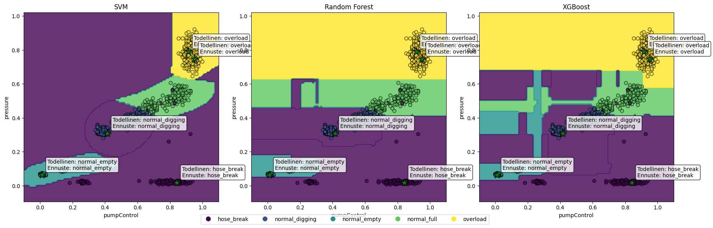
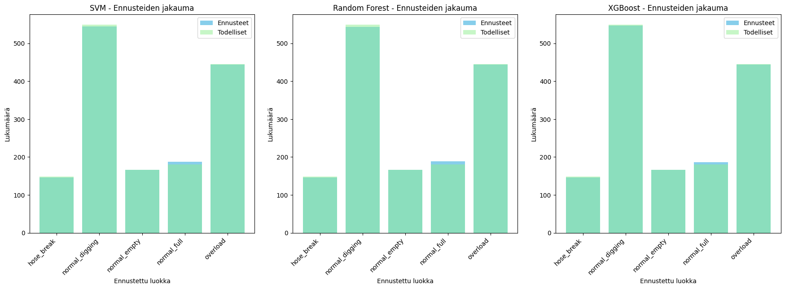

# Hydrauliikkajärjestelmän koneoppimismallien kattava analyysi

## Johdanto

Tässä raportissa esitetään kattava analyysi kolmesta koneoppimismallista, joita on käytetty hydrauliikkajärjestelmän tilan luokitteluun:

- Support Vector Machine (SVM)
- Random Forest
- XGBoost

Analyysi kattaa mallien suorituskyvyn, päätösrajapinnat, sekaannusmatriisit, ROC-käyrät, Precision-Recall -käyrät, piirteiden tärkeyden sekä ennusteiden visualisoinnin.

## Mallien suorituskyky

### Tarkkuus (Accuracy)

Kaikki kolme mallia saavuttivat erinomaisen suorituskyvyn testidatalla:

- **SVM**: 99.06%
- **Random Forest**: 99.13%
- **XGBoost**: 99.06%

Random Forest -malli saavutti hieman paremman tarkkuuden kuin muut mallit, mutta erot ovat hyvin pieniä. Tämä osoittaa, että kaikki mallit ovat erittäin tehokkaita hydrauliikkajärjestelmän tilan luokittelussa.

### Luokkakohtaiset metriikat

Alla olevassa taulukossa on esitetty mallien suorituskyky luokkakohtaisesti:

| Luokka | Malli | Precision | Recall | F1-score |
|--------|-------|-----------|--------|----------|
| hose_break | SVM | 1.0000 | 0.9799 | 0.9898 |
| hose_break | Random Forest | 1.0000 | 0.9799 | 0.9898 |
| hose_break | XGBoost | 1.0000 | 0.9799 | 0.9898 |
| normal_digging | SVM | 0.9945 | 0.9872 | 0.9909 |
| normal_digging | Random Forest | 0.9963 | 0.9872 | 0.9918 |
| normal_digging | XGBoost | 0.9927 | 0.9891 | 0.9909 |
| normal_empty | SVM | 1.0000 | 1.0000 | 1.0000 |
| normal_empty | Random Forest | 1.0000 | 1.0000 | 1.0000 |
| normal_empty | XGBoost | 1.0000 | 1.0000 | 1.0000 |
| normal_full | SVM | 0.9415 | 0.9833 | 0.9620 |
| normal_full | Random Forest | 0.9418 | 0.9889 | 0.9648 |
| normal_full | XGBoost | 0.9462 | 0.9778 | 0.9617 |
| overload | SVM | 1.0000 | 0.9978 | 0.9989 |
| overload | Random Forest | 1.0000 | 0.9978 | 0.9989 |
| overload | XGBoost | 1.0000 | 0.9978 | 0.9989 |

Huomionarvoista on, että:
- Kaikki mallit tunnistavat `normal_empty`-tilan täydellisesti (100% tarkkuus ja saanti)
- `normal_full`-tilan tunnistamisessa on hieman enemmän haasteita kuin muissa tiloissa
- `hose_break`-tilan tunnistamisessa recall on hieman alhaisempi kuin precision, mikä tarkoittaa että joitakin letkurikkoja jää tunnistamatta

## Päätösrajapinnat

Päätösrajapintakuvaajat näyttävät, miten kukin malli jakaa syöteavaruuden eri luokkien alueisiin. Kuvaajista voidaan havaita:

1. Kaikki mallit muodostavat selkeät rajat eri tilojen välille
2. SVM-malli luo sileimmät rajapinnat, mikä on tyypillistä tukivektorikoneille
3. Random Forest ja XGBoost -mallit luovat hieman monimutkaisempia rajapintoja, mikä heijastaa niiden kykyä mallintaa epälineaarisia suhteita
4. Luokat ovat hyvin eroteltavissa, mikä selittää mallien korkean suorituskyvyn

## Sekaannusmatriisit

Sekaannusmatriisit osoittavat, että:

1. Suurin osa virheluokitteluista tapahtuu `normal_full` ja `normal_digging` -tilojen välillä
2. `normal_empty` -tila tunnistetaan täydellisesti
3. `overload` ja `hose_break` -tilat tunnistetaan erittäin hyvin, mikä on tärkeää turvallisuuden kannalta

## ROC-käyrät ja Precision-Recall -käyrät

ROC- ja Precision-Recall -käyrät osoittavat mallien erinomaisen erottelukyvyn. SVM-mallille näitä käyriä ei voitu laskea, koska se ei tue todennäköisyysennusteita (`predict_proba`-metodia).

## Piirteiden tärkeys

Piirteiden tärkeysanalyysi Random Forest ja XGBoost -malleille osoittaa, että:

1. `pressure`-muuttuja on hieman tärkeämpi kuin `pumpControl`-muuttuja molemmissa malleissa
2. Tämä vahvistaa aiemman analyysin tulokset, joissa `pressure`-muuttujan tärkeys oli 0.56 ja `pumpControl`-muuttujan 0.44

## Ennusteiden visualisointi

Ennusteiden visualisoinnit osoittavat, että:

1. Mallit tekevät hyvin samankaltaisia ennusteita
2. Ennusteiden jakauma vastaa hyvin todellista jakaumaa
3. Virheluokittelut ovat harvinaisia ja tapahtuvat pääasiassa luokkien rajapinnoilla

Lisäksi luotiin animoitu GIF-tiedosto (`modelPredictions.gif`), joka näyttää mallien ennusteet reaaliajassa eri pisteille.

## Johtopäätökset

Analyysin perusteella voidaan tehdä seuraavat johtopäätökset:

1. **Mallien suorituskyky**: Kaikki kolme mallia suoriutuvat erinomaisesti hydrauliikkajärjestelmän tilan luokittelussa, saavuttaen yli 99% tarkkuuden. Random Forest -malli saavutti hieman paremman tarkkuuden (99.13%) kuin SVM ja XGBoost (molemmat 99.06%).

2. **Luokkakohtainen suorituskyky**: Kaikki mallit tunnistavat erityisen hyvin `normal_empty`, `overload` ja `hose_break` -tilat. `normal_full` -tilan tunnistamisessa on hieman enemmän haasteita.

3. **Piirteiden tärkeys**: `pressure`-muuttuja on hieman tärkeämpi kuin `pumpControl`-muuttuja mallien päätöksenteossa.

4. **Mallien erot**: SVM-malli luo sileimmät päätösrajapinnat, kun taas Random Forest ja XGBoost luovat monimutkaisempia rajapintoja. SVM-malli ei tue todennäköisyysennusteita, mikä rajoittaa sen käyttöä joissain sovelluksissa.

5. **Käytännön soveltuvuus**: Kaikki mallit soveltuvat erinomaisesti hydrauliikkajärjestelmän tilan luokitteluun. Mallin valinta riippuu sovelluksen vaatimuksista:
   - Jos tarvitaan todennäköisyysennusteita, Random Forest tai XGBoost ovat parempia vaihtoehtoja
   - Jos tarvitaan yksinkertaisempaa mallia, SVM on hyvä valinta
   - Jos tarkkuus on tärkein kriteeri, Random Forest on hieman parempi

## Suositukset

Analyysin perusteella suositellaan:

1. **Random Forest -mallin käyttöä** ensisijaisena mallina hydrauliikkajärjestelmän tilan luokitteluun sen hieman paremman tarkkuuden ja todennäköisyysennusteiden tuen vuoksi.

2. **Molempien piirteiden säilyttämistä** mallissa, sillä sekä `pumpControl` että `pressure` ovat tärkeitä luokittelun kannalta.

3. **Erityishuomion kiinnittämistä `normal_full` -tilan tunnistamiseen**, sillä se on hieman haastavampi tunnistaa kuin muut tilat.

4. **Mallin käyttöönottoa tuotannossa**, sillä kaikki mallit osoittavat erinomaista suorituskykyä ja soveltuvat hyvin hydrauliikkajärjestelmän tilan luokitteluun.
